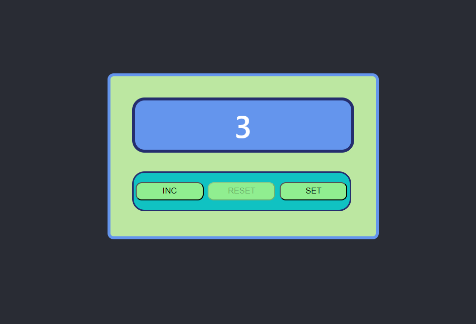
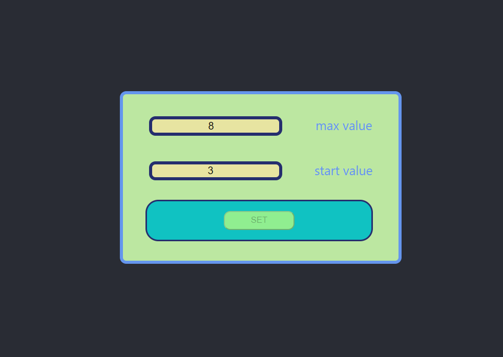

# Counter

### The project  is a simple web application that serves as a counter. The primary goal of this project is to provide a hands-on experience with Redux, local storage, and state management in a React application. It allows users to increment and reset a counter while maintaining state across sessions using local storage.

https://alik-avizha.github.io/counter_version_two

Below you can see a bit of information about this app.

### Technologies:

- React
- TypeScript
- Redux
